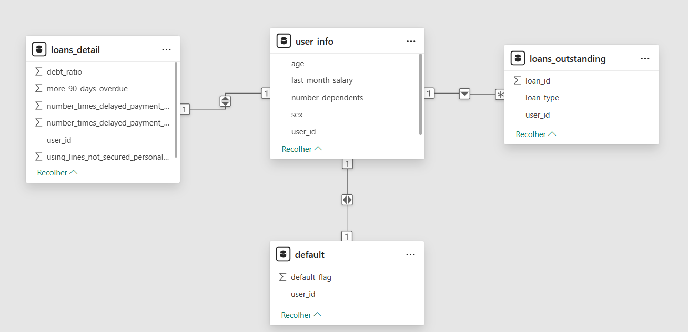

# laboratoria-analise-risco

# 1. Contexto e Objetivo da Análise

O Banco Super Caja está enfrentando o desafio de automatizar o seu processo de análise de crédito, através de técnicas de análise avançadas de dados que visam melhorar a eficiência, precisão e rapidez destas análises. 
Atualmente a análise é realizada de forma manual, o que representa uma demanda alta para o setor, sobrecarregando o mesmo e afetando negativamente o prazo para análises e, consequentemente, a satisfação dos clientes.
A automação do processo irá permitir ao banco uma melhor tomada de decisão na concessão de créditos, além de fortalecer a capacidade do modelo de identificação de riscos, contribuindo para a solidez financeira e eficiência operacional do banco.
As principais questões que procuraremos responder incluem: 
- Quais variáveis ​​mais influenciam o risco de inadimplência?
- Como essas variáveis ​​se correlacionam entre si e com o comportamento de pagamento do cliente?

Sendo assim, o objetivo é automatizar o processo de análise de crédito do banco Caja.

# 2. Ferramentas e Tecnologias utilizadas
- Google BigQuery: Data warehouse que permite o processamento de manipulação de grandes volumes de dados em SQL;
- Google Colab: Manipulação de dados com a linguagem Python;
- Google Looker Studio: Criação e edição de painéis e relatórios de dados;

# 3. Conjunto de dados (dataset) e preparação da base para análise
O conjunto de dados está disponível no arquivo *banco_caja.zip* deste projeto.
A descrição de como estão organizadas as tabelas e variáveis que as compõe, podem ser verificadas [aqui](Dataset.md).

As tabelas possuem o seguinte relacionamento:

A importação da base de dados foi realizada no BigQuery, onde foram realizadas consultas para verificação e tratamento de valores nulos e duplicados.
Utilizando a função SQL `SELECT COUNT DISTINCT`, observou-se que as tabelas apresentaram 36.000 registros únicos pelo user_id, exceto a tabela loans_outstanding, com 35.575 registros. 
Ou seja, há 425 registros que não possuem informação de user_id na tabela loans_outstanding, para os user_id existentes na tabela user_info. Esse valor representa cerca de 1% da amostra total e portanto, optou-se por excluir tais valores (realizando INNER JOIN e considerando o user_id da tabela loans_outstanding), já que não temos identificação destes clientes e a análise poderia ficar prejudicada.

Na sequência, para entender melhor a distribuição dos dados e possíveis correlações, foi calculada a correlação entre as variáveis da tabela loans_details, e o desvio padrão de algumas delas, a fim de identificar qual a melhor variável para considerar no modelo de regressão linear. Foi escolhida a variável `number_times_delayed_payment_loan_30_59_days`.

Quanto a identificação de outliers, optei por não excluir nem tratar tais valores, considerando que podemos fazer uma análise mais robusta na etapa seguinte, análise exploratória, e tratar tais dados, caso interfiram fortemente na análise.
