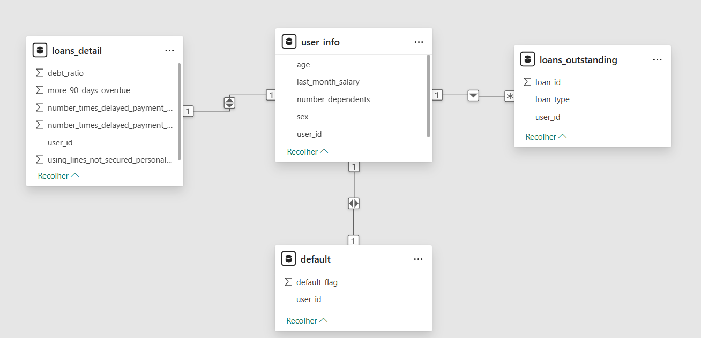
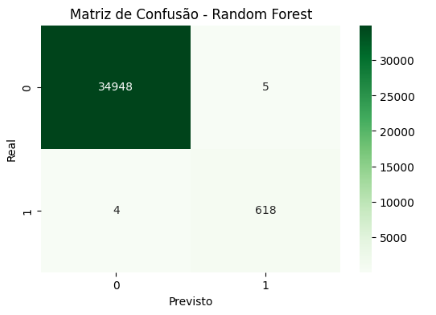

# laboratoria-analise-risco

# 1. Contexto e Objetivo da Análise

O Banco Super Caja está enfrentando o desafio de automatizar o seu processo de análise de crédito, através de técnicas de análise avançadas de dados que visam melhorar a eficiência, precisão e rapidez destas análises. 
Atualmente a análise é realizada de forma manual, o que representa uma demanda alta para o setor, sobrecarregando o mesmo e afetando negativamente o prazo para análises e, consequentemente, a satisfação dos clientes.
A automação do processo irá permitir ao banco uma melhor tomada de decisão na concessão de créditos, além de fortalecer a capacidade do modelo de identificação de riscos, contribuindo para a solidez financeira e eficiência operacional do banco.
As principais questões que procuraremos responder incluem: 
- Quais variáveis ​​mais influenciam o risco de inadimplência?
- Como essas variáveis ​​se correlacionam entre si e com o comportamento de pagamento do cliente?

Sendo assim, o objetivo é automatizar o processo de análise de crédito do banco Caja.

# 2. Ferramentas e Tecnologias utilizadas
- Google BigQuery: Data warehouse que permite o processamento de manipulação de grandes volumes de dados em SQL;
- Google Colab: Manipulação de dados com a linguagem Python;
- Google Looker Studio: Criação e edição de painéis e relatórios de dados;


# 3. Conjunto de dados (dataset) e preparação da base para análise
O conjunto de dados está disponível no arquivo *banco_caja.zip* deste projeto.
A descrição de como estão organizadas as tabelas e variáveis que as compõe, podem ser verificadas [aqui](Dataset.md).

As tabelas possuem o seguinte relacionamento:


A importação da base de dados foi realizada no BigQuery, onde foram realizadas consultas para verificação e tratamento de valores nulos e duplicados.
Utilizando a função SQL `SELECT COUNT DISTINCT`, observou-se que as tabelas apresentaram 36.000 registros únicos pelo user_id, exceto a tabela loans_outstanding, com 35.575 registros. 
Ou seja, há 425 registros que não possuem informação de user_id na tabela loans_outstanding, para os user_id existentes na tabela user_info. Esse valor representa cerca de 1% da amostra total e portanto, optou-se por excluir tais valores (realizando INNER JOIN e considerando o user_id da tabela loans_outstanding), já que não temos identificação destes clientes e a análise poderia ficar prejudicada.


Na sequência, para entender melhor a distribuição dos dados e possíveis correlações, foi calculada a correlação entre as variáveis da tabela loans_details, e o desvio padrão de algumas delas, a fim de identificar qual a melhor variável para considerar no modelo de regressão linear. Foi escolhida a variável `number_times_delayed_payment_loan_30_59_days`.

Quanto a identificação de outliers, optei por não excluir nem tratar tais valores, considerando que podemos fazer uma análise mais robusta na etapa seguinte, análise exploratória, e tratar tais dados, caso interfiram fortemente na análise.


# 4. Análise exploratória
Para melhor visualização dos dados, foram construídos no Looker Studio (com a importação da tabela única criada no BigQuery) gráficos considerando as variáveis principais: idade (`age`), salário (`salario_tratado`), taxa de endividamento (`debt_ratio`), dependentes (`dependentes_tratado`), uso de linha de crédito (`using_lines_not_secured_personal_assets`), taxa de atraso (`number_times_delayed_payment_loan_30_59_days`) e total_empréstimos (somando as variáveis `qde_real_state`e `qtde_other`).

Para observar as medidas de tendência central (média e mediana), construí uma tabela com os valores para: salário, dependentes, taxa de atraso, taxa de endividamento e uso de linha de crédito. Foram construídos, também, histogramas e gráficos de boxplot considerando: total de empréstimos, distribuição de idade e distribuição salarial. Para uma melhor visualização, filtrei salários até 10.000 e idade entre 20 e 100 anos, o que exclui outliers da visualização, melhorando a percepção da distribuição da amostra. Também foram construídos Histogramas para Taxa de endividamento médio por faixa etária e Faixa salarial dos clientes.

Foi realizado o cálculo dos quartis da variável idade, na sequência o cálculo da taxa de inadimplência para cada quartil, considerando totais clientes / clientes inadimplentes. Depois, considerando a menor taxa de inadimplência como taxa referência, foi realizado o cálculo do risco relativo para cada quartil (taxa inadimplência / taxa referência), conforme a view:

```
--Quartis por idade
WITH
idade_quartil AS (
  SELECT
  user_id,
  age,
  default_flag,
  NTILE(4) OVER (ORDER BY age) AS faixa_idade

  FROM `risco-relativo-460118.dadosbancocaja.view-tab-unica`

  WHERE age IS NOT NULL
),

--Cálculo da taxa de inadimplência
inadimplencia_por_idade AS (
  SELECT
  faixa_idade,
  COUNT(*) AS total_pessoas,
  SUM(CASE WHEN default_flag = 1 THEN 1 ELSE 0 END) AS inadimplentes,
  ROUND(SAFE_DIVIDE(SUM(CASE WHEN default_flag = 1 THEN 1 ELSE 0 END), COUNT(*)), 4) AS taxa_inadimplencia,
  FROM idade_quartil
  GROUP BY faixa_idade
),

--Considerar a menor taxa_inadimplência como referência
menor_taxa AS (
  SELECT MIN(taxa_inadimplencia) AS taxa_ref
  FROM inadimplencia_por_idade
)

--Select calculando o risco relativo de cada quartil
SELECT
  i.faixa_idade,
  i.total_pessoas,
  i.inadimplentes,
  i.taxa_inadimplencia,
  ROUND(i.taxa_inadimplencia / m.taxa_ref, 2) AS risco_relativo
FROM inadimplencia_por_idade i
CROSS JOIN menor_taxa m
ORDER BY risco_relativo DESC;

```


Para trabalhar de forma mais prática, construí uma consulta unindo as variáveis analisadas e retornando, para cada uma, sua faixa (quartil), total de pessoas, total de inadimplentes, taxa de inadimplência e risco relativo. Podendo observar assim os dados, conjuntamente.


Para analisar possíveis correlações entre as variáveis numéricas, optei por realizar os cálculos no BigQuery, através da função `CORR`, para encontrar as correlações mais relevantes.
Os resultados não foram muito expressivos, destacando-se as correlações entre: idade/total de empréstimos (0,1355) e salário/total de empréstimos (0,1139), as demais apresentaram valores muito próximos a zero.
Como complemento, criei gráficos de dispersão para entender a forma como estas relações ocorrem. Para a variável salário há alguns outliers que afetam o comportamento no gráfico, por isso, adicionei um filtro para não exibir valores de salário acima de R$50mil.


# 5. Técnica de Análise
Por se tratar de uma análise mais específica da área financeira, nesse ponto, foi realizada a técnica estatística de cálculo de risco relativo, que estima a probabilidade de que um evento (como a inadimplência em um empréstimo) ocorra em um grupo específico. A ideia é através da análise das diversas variáveis, segmentar os clientes em diferentes categorias de risco, para só então chegar a uma pontuação de crédito.


### 5.1 Cálculo de risco relativo

Esta técnica nos permite construir um modelo preditivo para identificar e classificar o risco com precisão, facilitando a tomada de decisão. Optei por utilizar a view anterior já unificada com os quartis de cada variável e respectivos cálculos de inadimplência e risco relativo. Adicionei a isso, a seleção de um quartil (Q1) e sua comparação com os demais (Q2, Q3, Q4), calculando a inadimplência e o risco relativo. Na sequência, realizei o mesmo processo para: Q2 versus demais quartis, Q3 versus demais quartis e Q4 versus demais quartis.

Para melhor visualização, montei a seguinte tabela, destacando o quartil que apresenta o maior risco relativo, para cada variável analisada:

|      variável         |      quartil destacado      |  valor do risco relativo  |
|-----------------------|-----------------------------|---------------------------|
| Dependentes           |              Q4             |           1,61            | 
| Idade                 |              Q1             |           2,26            |
| Limite de crédito     |              Q4             |          46,93            |
| Salário               |              Q2             |           1,96            |
| Total de empréstimos  |              Q1             |           2,13            |
| Taxa de atraso        |              Q4             |          32,00            |
| Taxa de endividamento |              Q3             |           1,45            |


### 5.2 Segmentação

Considerei a variável Dummy (binária) da seguinte maneira: valor 1 para a variável default_flag igual a inadimplente e valor 0 adimplente/bom pagador. Sendo assim, o valor real considera a default_flag, e o valor previsto a presença em algum dos quartis acima, considerado de maior risco para inadimplência. Para realizar a segmentação, primeiro, foi necessário segmentar cada variável de acordo com seus quartis, atribuindo peso (de 1 a 4) considerando 1 risco muito baixo, 2 baixo, 3 alto e 4 muito alto.

No BigQuery, criei uma tabela auxiliar (view), atribuindo os quartis de cada variável, depois juntei os quartis por cliente e atribuí peso para os quartis de acordo com os seus riscos relativos personalizados, calculados anteriormente. 
Na sequência, a ideia é reorganizar os dados, calcular o score de risco de cada cliente, para então classificar como bom ou mau pagador. E por último, gerar a matriz de confusão, verificando se a previsibilidade pensada está de acordo com os resultados encontrados para a default_flag.

Para ajustar melhor o modelo, optei por alterar o peso de algumas variáveis:
limite_crédito: Q4=4, Q3=2, Q2=2, Q1=1;
txa_atraso: Q4=4, Q3=2, Q2=1, Q1=2;
txa_endivid: Q4=3, Q3=4, Q2=2, Q1=2;
salario: Q4=1, Q3=2, Q2=4, Q1=2;
total_emprestimos: Q4=2, Q3=2, Q2=3, Q1=4;


Após o ajuste do modelo, fiz alguns testes, com diferentes valores para o limiar. 
A matriz de confusão, para o limiar 22, apresentou os valores: 399 TP (verdadeiros positivos), 223 FP (falsos positivos), 3728 FN (falsos negativos) e 31225 TN (verdadeiros negativos). As principais métricas de desempenho do modelo foram também calculadas: Acurácia (88,89%), Precisão (64,15%) e Recall (9,7%).

Com o modelo ajustado, dividi os clientes em 3 faixas quanto ao risco de inadimplência:
Alto risco: score maior que 22;
Médio risco: score entre 18 e 22;
Baixo risco: score menor que 18;

O modelo pode ser considerado conservador e talvez precise de uma etapa manual complementar, para tratar falsos positivos, mas também possui o menor número de falsos negativos (cerca de 10% da amostra).


# 6. Regressão Logística
A regressão logística trata-se de uma extensão da análise de correlação realizada anteriormente, e se concentra em situações onde a variável resposta é categórica. Aqui, considera-se, uma única variável independente e avaliamos como isso afeta uma variável dependente com duas únicas opções, como sim ou não, no caso, a inadimplência.

Depois de diversos ajustes do modelo preditivo, chegou-se a conclusão que seria melhor a utilização do modelo não linear Random Forest. Isso, devido ao fato dele não assumir nenhuma fórmula matemática rígida, como a regressão logística. Então ele simplesmente, aprende com base num “se…então”, que levou a resultados melhores para os dados analisados, pois permitiu capturar padrões mais complexos entre as variáveis.

Acredito que pela presença de outliers que optei em não excluir, a regressão logística não conseguiu encontrar um padrão claro para prever os inadimplentes, já com o Random Forest os inadimplentes foram detectados quase perfeitamente, o que deixou o modelo mais estável e confiável para os dados reais. O ajuste do modelo preditivo resultou na seguinte matriz:



